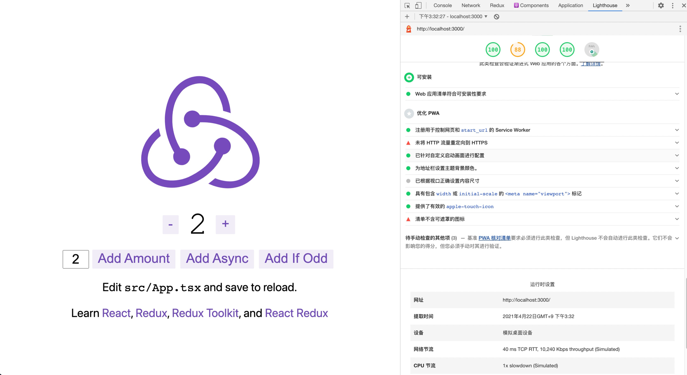

#### 拷贝配置文件到根目录
`cp envs/.env.local ./`

#### 安装依赖
`yarn`

#### 启动
`yarn dev`

#### 打开目录
`http://localhost:3000`

#### 部署
`yarn build`    
`yarn start`    

#### 特性
1. 支持typescript
2. 集成sass
3. 支持dotenv
4. 支持pwa
5. 集成了redux(redux-toolkit)
6. 自带了一个counter示例
7. 封装了axios，添加了拦截器

#### 目录结构说明
```
├── api                                    用于Http获取后端数据
├── components             自定义组件
├── pages                       页面（自动生成路由）
├── public                       放置静态文件，自动映射到根目录
├── store                        状态管理(store和slice)
├── styles                       需要打包编译的文件,如scss
├── utils                          通用方法
├── .gitignore                  git忽略文件
├── hook.ts                     RTK的API
├── next-env.d.ts             next对ts的支持声明
├── README.md             项目说明
├── next.config.js               next项目的配置文件
├── package.json            依赖管理文件
└── yarn.lock                  版本依赖锁  
```

#### preview

